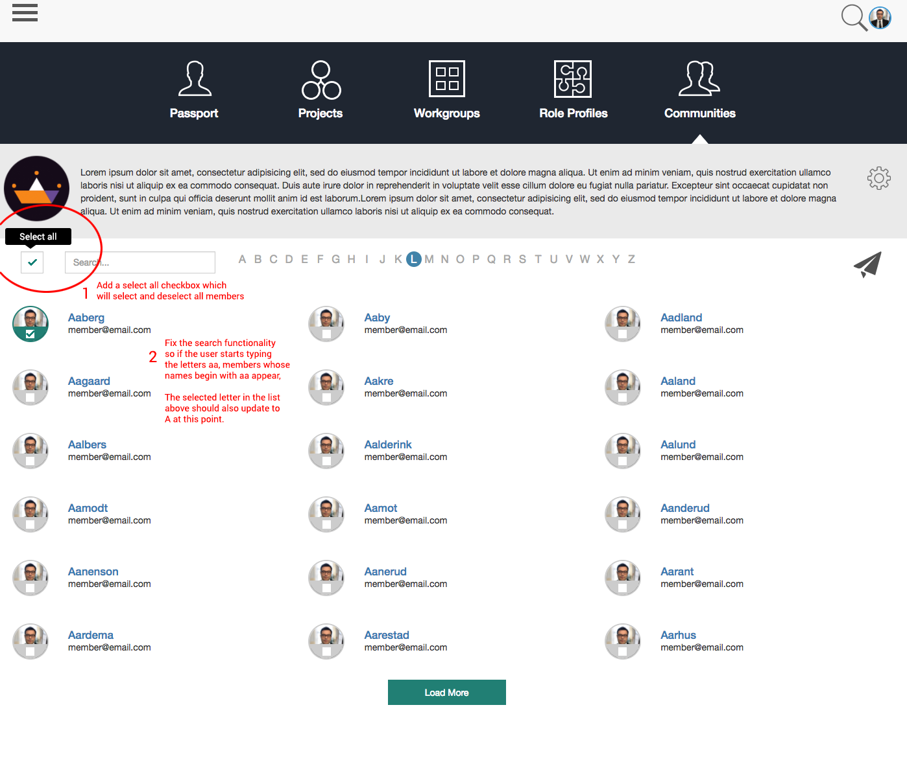

# angular1.4 dev test

This project is generated with [yo angular generator](https://github.com/yeoman/generator-angular)
version 0.11.1.

## Build & development

Run `grunt` for building and `grunt serve` for preview.

## Testing

Running `grunt test` will run the unit tests with karma.

# Instructions
Pull this repository, enter the boilerplate directory and run the code per above instructions.    
You should see a single page app that lokks like this:

1. You will need to create a checkbox that toggles all users selection
2. You will need to fix the search filter so that when a user starts typing into the search field, members with names starting with the substring will be displayed.

An instructions.png file is also provided with a visual representation of the above.

